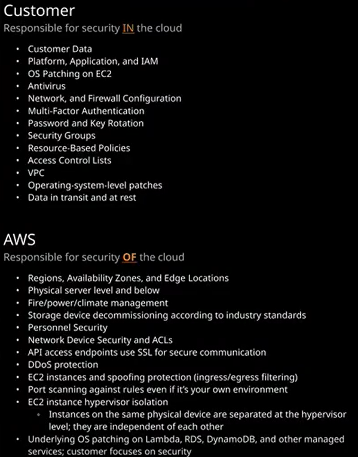

### Exam lab:

* https://www.youtube.com/watch?v=qUXzwHjX7CA
* file:///Users/devops/labs/AWS-SysOps/PDF/AWS-Certified-SysOps-Administrator-Associate_Sample-Questions.pdf

### Youtube

* https://www.youtube.com/watch?v=9nHq_nt9Rbc +
* https://www.youtube.com/watch?v=YDQ4qkEr-ck&list=PLcT53hTjpf2tviy3FXr9NNQjoDQizbKOR
* https://www.youtube.com/watch?v=q8hVhntMenE&list=RDCMUCEcj1-hpydLum2N1d02Leuw&index=2
* https://www.youtube.com/watch?v=Kb24Fqf3Dfk

### Tests

* https://www.examtopics.com/exams/amazon/aws-certified-sysops-administrator-associate/view/
* https://d1.awsstatic.com/training-and-certification/docs-sysops-associate/AWS-Certified-SysOps-Administrator-Associate_Sample-Questions.pdf

### PDF

### Shared model

### DOCS

https://aws.amazon.com/certification/certified-sysops-admin-associate/

